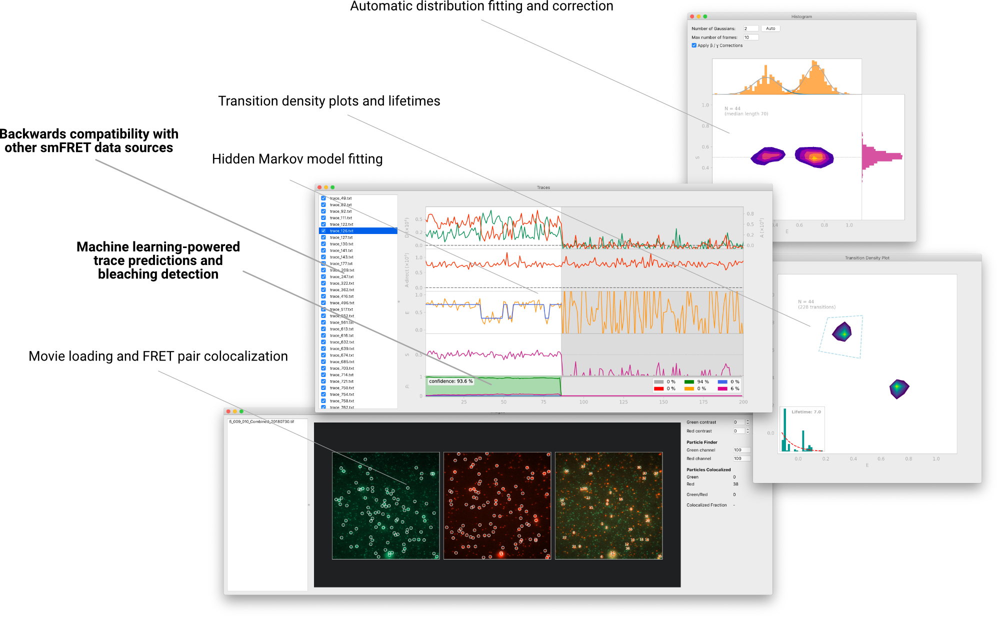
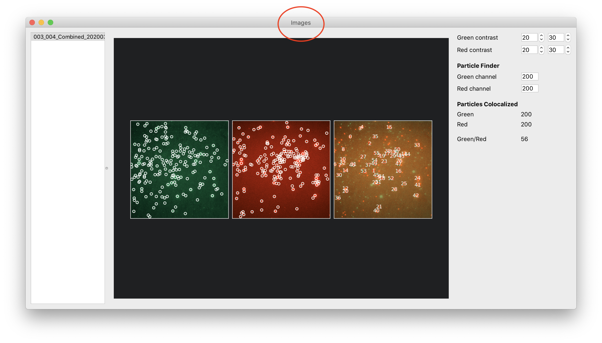
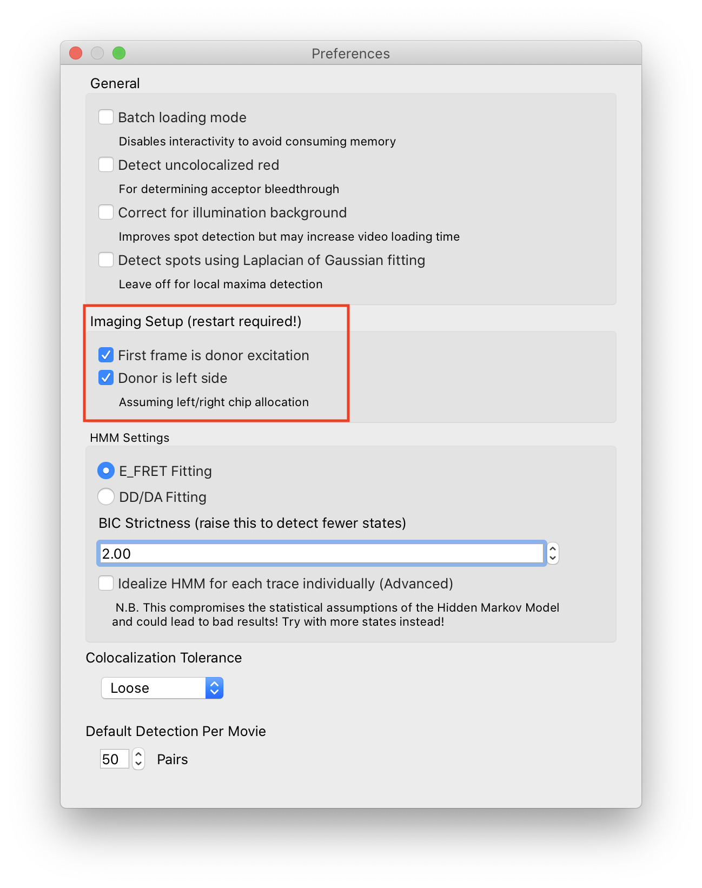
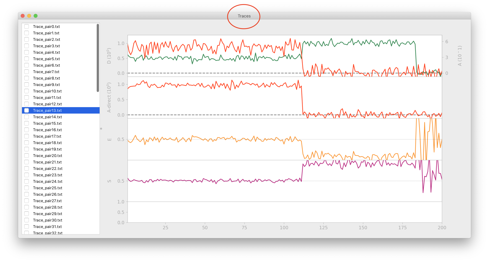
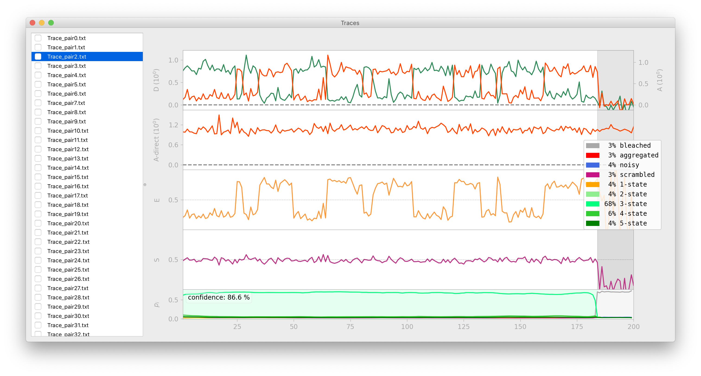
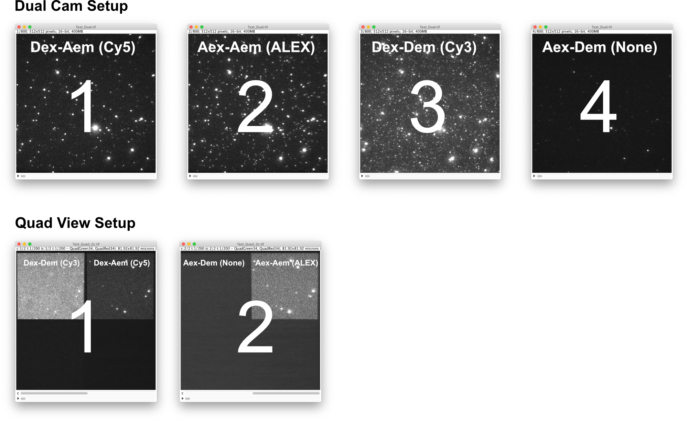
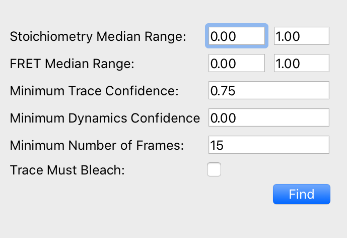

# DeepFRET
A fully open-source, all-inclusive software platform for doing total internal reflection microscopy (TIRFm) single molecule
FRET (smFRET) fast and efficiently. The key feature is reverse-loading of ASCII traces, and *Keras/TensorFlow-powered automatic trace sorting*. Features include

- Advanced trace sorting
- Optical correction factors
- Hidden Markov model fitting and lifetime plotting
- Memory-free movie batch loading
- Distribution plotting and fitting
- Backwards-compatibility with iSMS-exported data

If you'd like to play around with just the Keras/TensorFlow model, please go to https://github.com/komodovaran/DeepFRET-Model

### How to cite
Preprint can be found at:
https://www.biorxiv.org/content/10.1101/2020.06.26.173260v1

````
DeepFRET: Rapid and automated single molecule FRET data classification using deep learning
Johannes Thomsen, Magnus B. Sletfjerding, Stefano Stella, Bijoya Paul, Simon Bo Jensen, Mette G. Malle, Guillermo Montoya, Troels C. Petersen, Nikos S. Hatzakis
bioRxiv 2020.06.26.173260; doi: https://doi.org/10.1101/2020.06.26.173260
````

## Launching the DeepFRET GUI
Tested on Python 3.7.0 (v3.7.0:1bf9cc5093)

From source:
1. Download the repository contents. Install requirements.txt either globally or in a venv (strongly recommended)
2. Run `src/main/python/main.py`

With the `.dmg` file:
1. Installing the `DeepFRET.app` from binary
2. Double click the `DeepFRET.app` file.

## Loading data
1. To load videos, open the application's main window ('Images')



and go to File &rightarrow; Open files. The current
version of DeepFRET supports *only* videos made with alternating laser excitation (ALEX). Donor order and appearance
can be set in Preferences. The rest of the video layout is auto-guessed by the software and doesn't allow for
fine-tuning, so be sure to set up new experiments properly!



2. If you would like to extract traces from a large number of videos that don't fit into memory, you can tick the
'batch mode' option in Preferences, as well as set a number of detections per movie. This disables the option to
interactively re-run spot detection analysis, but allows the software to process an essentially unlimited number of
videos. 

3. If you've already exported a lot of smFRET traces from another software, but want to do your analysis in DeepFRET,
you can even load in traces directly, without movies. Simply make sure that the trace window ('Traces') is the active
window, and follow the same steps as above for loading data. This works both for traces with and without ALEX.


 
## Classifying the data
1. Go to Analyze &rightarrow; Predict to predict the trace type using deep learning. A confidence score will be given
for each trace, which tells you how certain the model is that this is a true smFRET trace.


 
2. To sort traces by different things, go to the View menu. The option "advanced sort" includes, among other things,
a lower confidence threshold.

## Windows
The following shortcuts can be used to navigate the different windows, also found in the menu option `Window`:

|Window|Shortcut|
|---|---|
|Images |`⌘1`|
|Traces |`⌘2`|
|Histogram |`⌘3`|
|Transition Density |`⌘4`|
|Trace Simulator |`⌘5`|

## Images Window
- To load a video file, use the shortcut `File > Open Files` or the hotkey `⌘O`.
- To analyze and extract traces, use the options in the menu tab `Analyze`

## Traces Window
- To load traces, use the shortcut `File > Open Files` or the hotkey `⌘O`.
- To use the DeepFRET Deep Learning trace selection model, use the options in `Analyze > Predict` to predict trace types for selected or all traces.
- To fit a Hidden Markov Model to all traces, highlight all traces with `Edit > Select All` or `⌘A` and analyze by `Analyze > Fit Hidden Markov To Selected`.

## Histogram Window 
- View distribution of EFRET and Stoichiometry values for a given number of frames.
- Fit a Gaussian Mixture by defining the number or press "Auto" to use a BIC-optimized number of Gaussians.

## Transition Density Window
- View Transition Density of transitions in the Hidden Markov Model fit in the Traces Window. 
Only works if a Hidden Markov Model has been fit to the traces
- Set the number of clusters (transitions) per half of the TDP plot to extract lifetimes for each transition. 
The number of clusters per half is typically equal to the number of states.
- N.B. In order to see wider distributions, change the Preferences to Idealize traces individually. (requires restart)

## Trace Simulator Window
- Choose the parameters with which to simulate traces and press the `Refresh` button. 
- To export traces, select the number of traces to export, and press the `Export` button. 

## Statistical analysis
1. To get an overview of data distributions, go to Windows &rightarrow; Histogram. This also allows to fit the FRET
distribution with gaussians to estimate the number of underlying conformational states. These plots update with the
number of traces selected. Because a large number of operations have to be re-computed every time a trace is
selected/de-selected, it can be a bit slow if the window is left open while traces are being selected.

2. Additionally, DeepFRET includes a Hidden Markov model with the possibility to fit each trace individually
(as a smoothing, "step-finding" method), as well as a global fit option, for a true Hidden Markov model fit. This also
automatically fits transition lifetimes and plots transition density plots (which can be found in
Windows &rightarrow; Transition Density Plot). One can base the model on the donor/acceptor signal, or directly on the
FRET signal (though this is less accurate)

The whole process should be cross-platform, but has only been tested on MacOS.

## Supported data formats
* Traces exported by DeepFRET or iSMS can be loaded by opening the Traces window, and then using the Open Files in the menu.
* Currently, .tiff videos are supported as either overlaid full frames in the correct sequence or 2-channel QuadView.
They can be loaded by choosing Open Files when the Images window is active. If batch loading is enable in the preferences,
you will be able to load an "unlimited" amount of videos and extract a set number of particles, with all video interactivity disabled.


* If you're having trouble with your image format, please file an Issue and I'll add compatibility.

## Modifying and compiling the DeepFRET GUI to a standalone executable:
1. Download all contents to a directory.
2. Open a terminal and navigate to the root of the directory.
3. Create a venv with `python3 -m venv venv` in the current directory.
4. Activate environment with `source venv/bin/activate` if on MacOS/Linux or `call venv\scripts\activate.bat` if on Windows.
5. While still in the environment, install all packages with `pip install -r requirements.txt`
6. Unzip the `hooks.zip` and overwrite the files in `venv/lib/python3.7/site-packages/PyInstaller/hooks/`.
7. Run `compile.py`

If the above steps worked, you can now edit any part of the code, and re-compile it (or just run it from the main.py
script, if desired). The `.ui` files for the interface can be edited through Qt Creator and converted with `generate_ui.py`


