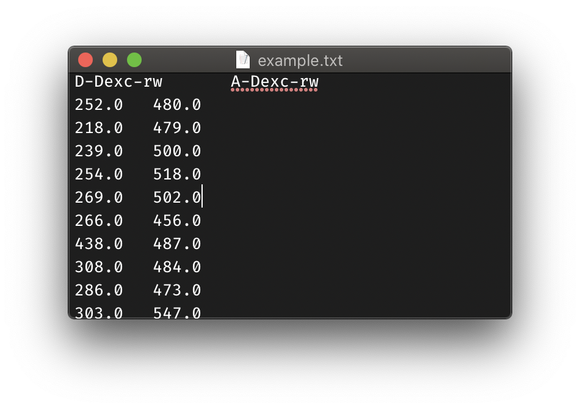

# DeepFRET
A fully open-source, all-inclusive software platform for doing total internal reflection microscopy (TIRFm) single molecule
FRET (smFRET) fast and efficiently. The key feature is reverse-loading of ASCII traces, and *Keras/TensorFlow-powered automatic trace sorting*. Features include

- Advanced trace sorting
- Optical correction factors
- Hidden Markov model fitting and lifetime plotting
- Memory-free movie batch loading
- Distribution plotting and fitting
- Backwards-compatibility with iSMS-exported data

If you'd like to play around with just the Keras/TensorFlow model, please go to https://github.com/komodovaran/DeepFRET-Model

### How to cite
Preprint can be found at:
https://www.biorxiv.org/content/10.1101/2020.06.26.173260v1

````
DeepFRET: Rapid and automated single molecule FRET data classification using deep learning
Johannes Thomsen, Magnus B. Sletfjerding, Stefano Stella, Bijoya Paul, Simon Bo Jensen, Mette G. Malle, Guillermo Montoya, Troels C. Petersen, Nikos S. Hatzakis
bioRxiv 2020.06.26.173260; doi: https://doi.org/10.1101/2020.06.26.173260
````

## Installing

The easiest way to run DeepFRET-GUI is to download the newest installer for your
system from the [releases
page](https://github.com/hatzakislab/DeepFRET-GUI/releases). We currently
support macOS and Windows.

If you want to change the code, you can also [install from
source](#development-environment).

## Loading data
1. To load videos, open the application's main window ('Images')


and go to File &rightarrow; Open files. The current
version of DeepFRET supports *only* videos made with alternating laser excitation (ALEX). Donor order and appearance
can be set in Preferences. The rest of the video layout is auto-guessed by the software and doesn't allow for
fine-tuning, so be sure to set up new experiments properly!


2. If you would like to extract traces from a large number of videos that don't fit into memory, you can tick the
'batch mode' option in Preferences, as well as set a number of detections per movie. This disables the option to
interactively re-run spot detection analysis, but allows the software to process an essentially unlimited number of
videos. 

3. If you've already exported a lot of smFRET traces from another software, but want to do your analysis in DeepFRET,
you can even load in traces directly, without movies. Simply make sure that the trace window ('Traces') is the active
window, and follow the same steps as above for loading data. This works both for traces with and without ALEX.


 
## Classifying the data
1. Go to Analyze &rightarrow; Predict to predict the trace type using deep learning. A confidence score will be given
for each trace, which tells you how certain the model is that this is a true smFRET trace.


 
2. To sort traces by different things, go to the View menu. The option "advanced sort" includes, among other things,
a lower confidence threshold.

## Windows
The following shortcuts can be used to navigate the different windows, also found in the menu option `Window`:

|Window|Shortcut|
|---|---|
|Images |`⌘1`|
|Traces |`⌘2`|
|Histogram |`⌘3`|
|Transition Density |`⌘4`|
|Trace Simulator |`⌘5`|

## Images Window
- To load a video file, use the shortcut `File > Open Files` or the hotkey `⌘O`.
- To analyze and extract traces, use the options in the menu tab `Analyze`

## Traces Window
- To load traces, use the shortcut `File > Open Files` or the hotkey `⌘O`.
- To use the DeepFRET Deep Learning trace selection model, use the options in `Analyze > Predict` to predict trace types for selected or all traces.
- To fit a Hidden Markov Model to all traces, highlight all traces with `Edit > Select All` or `⌘E` and analyze by `Analyze > Fit Hidden Markov To Selected`.
- Hidden Markov Model advanced settings can be tuned in `Preferences > HMM settings`. Options allow to fit each trace individually or all traces globally, to use either EFRET or DD/DA intensities for HMM fitting, and set a BIC strictness parameter to change the sensitivity of the Hidden Markov Model. NB. Lower BIC strictness, individual trace fitting and EFRET fitting will be more prone to pick up noise.
- Traces can be exported as `.txt` files for further analysis.

## Histogram Window 
- View distribution of EFRET and Stoichiometry values for a given number of frames.
- Fit a Gaussian Mixture by defining the number or press "Auto" to use a BIC-optimized number of Gaussians.
- Histograms can be exported in `.pdf` format (publication quality).

## Transition Density Window
- View Transition Density of transitions in the Hidden Markov Model fit in the Traces Window.
Only works if a Hidden Markov Model has been fit to the traces.
- Set the number of clusters (transitions) per half of the TDP plot to extract lifetimes for each transition. 
The number of clusters per half is typically equal to the number of states.
- N.B. In order to see wider distributions, change the Preferences to Idealize traces individually. (will only apply to new traces, so might require restart.)
- Transition Density plots and lifetime distributions can be exported in `.pdf` format (publication quality).

## Trace Simulator Window
- Choose the parameters with which to simulate traces and press the `Refresh` button. 
- To export traces, select the number of traces to export, and press the `Export` button. 

## Statistical analysis
1. To get an overview of data distributions, go to Windows &rightarrow; Histogram. This also allows to fit the FRET
distribution with gaussians to estimate the number of underlying conformational states. These plots update with the
number of traces selected. Because a large number of operations have to be re-computed every time a trace is
selected/de-selected, it can be a bit slow if the window is left open while traces are being selected.

2. Additionally, DeepFRET includes a Hidden Markov model with the possibility to fit each trace individually
(as a smoothing, "step-finding" method), as well as a global fit option, for a true Hidden Markov model fit. This also
automatically fits transition lifetimes and plots transition density plots (which can be found in
Windows &rightarrow; Transition Density Plot). One can base the model on the donor/acceptor signal, or directly on the
FRET signal (though this is less accurate)

The whole process should be cross-platform, but has only been tested on MacOS.

## Supported data formats
* Traces exported by DeepFRET or iSMS can be loaded by opening the Traces window, and then using the Open Files in the menu.
* Other traces must support some, or all of the following format:

    |Column|Meaning|
    |---|---|
    |`D-Dexc-rw` | Donor excitation, donor emission signal|
    |`A-Dexc-rw` | Donor excitation, acceptor emission signal|
    |`A-Aexc-rw` | Acceptor excitation, acceptor emission signal|
    |`D-Dexc-bg` | Donor excitation, donor emission background|
    |`A-Dexc-bg` | Donor excitation, acceptor emission background|
    |`A-Aexc-bg` | Acceptor excitation, acceptor emission background|

* CSV files are supported with variable empty spaces between columns (1, 2, tabs, etc)
At the very minimum, your trace must have a `D-Dexc-` column first, as DeepFRET seeks for this to find the rest.
Background columns can be ommitted or set to 0, and missing `A-Aexc-` columns can be either ommitted or set to NaN (do not set `A-Aexc-rw` to 0, as this indicates the presence of a channel).
At the very minimum, DeepFRET is able to load a trace with just the columns `D-Dexc-rw` and `A-Dexc-rw`.
Other columns not in the specification are simply ignored.



* When saving traces, they will outputted in DeepFRET format.

* DeepFRET does not support time columns, and works on a per-frame basis.

* Currently, .tiff videos are supported as either overlaid full frames in the correct sequence or 2-channel QuadView.
They can be loaded by choosing Open Files when the Images window is active. If batch loading is enable in the preferences,
you will be able to load an "unlimited" amount of videos and extract a set number of particles, with all video interactivity disabled.


* If you're having trouble with your image format, please file an issue and we'll try to add compatibility.


# Development

The `.ui` files for the interface can be edited through Qt Creator, and when you
have a working python development env, converted with `generate_ui.py`.

## Development environment

This is only needed if you want to change the code. If you just want to run
DeepFRET-GUI, see [Install](#install).

### Unix

For macOS and Linux.

Make sure you have installed `python3.6` and `git`.

1. Clone the repo with `git clone https://github.com/hatzakislab/DeepFRET-GUI.git`.
2. Change into the directory with `cd DeepFRET-GUI`.
3. Create a python virtual environment with `python -m venv venv`.
4. Activate the virtual environment with `source venv/bin/activate`.
5. Install the python requirements with `pip install -r requirements-unix.txt`.

You should now be able to open the application with `python
src/main/python/main.py`.

See [New release](#new-release) if you now want to make a binary.

### Windows

#### Install dependencies

This needs to be done only once for the machine. The optional steps is needed if
you want to use `fbs` to make a new release. If you only want to change the
python code, you can skip them.

1. Python:
    1. Download and open the python 3.6 from [the python web
       page](https://www.python.org/downloads/windows/). Version 3.6.8 is the
       latest micro version with an executable installer for Windows.
    2. During the installation wizard make sure to check the "Add Python 3.6 to
       PATH" option.
2. Git from [the git web page](https://git-scm.com/download/win).
3. (Optional) Microsoft dependencies:
    1. Install [Windows 10
       SDK](https://developer.microsoft.com/en-us/windows/downloads/windows-10-sdk).
    2. Install [Visual C++ Redistributable for Visual Studio
       2010](https://www.microsoft.com/en-us/download/details.aspx?id=14632).
    3. Install [Visual C++ Redistributable for Visual Studio
       2012](https://www.microsoft.com/en-us/download/details.aspx?id=30679).
    4. If `fbs freeze` complains about missing DDLs and tells you to install
       Visual C++ Redistributable for Visual Studio 2012, it could be actually
       be another version. See [fbs issue
       147](https://github.com/mherrmann/fbs/issues/147) for details.
4. (Optional) Nullsoft Install System:
    1. Download and run the installer from [NSIS](https://nsis.sourceforge.io/Download).
    2. The installer does not add the executables like `makensis` to the path.
    You need to add `C:\Program Files (x86)\NSIS` to the path. You can add it
    permanently by following [this
    guide](https://www.architectryan.com/2018/03/17/add-to-the-path-on-windows-10/).
    Alternatively, you can execute `$env:PATH += "C:\Program Files (x86)\NSIS;"`
    in the PowerShell to set it for the session of the PowerShell.
5. Normal users on Windows are missing the privileged to execute PowerShell
   scripts. This is needed to enable the Python virtual environment. Open a
   PowerShell and run `Set-ExecutionPolicy -Scope CurrentUser -ExecutionPolicy
   Unrestricted`. Answer `Y` when prompted.
6. (Optional) If you have installed Windows 10 SDK, a C++ Redistributable or
   NSIS: Restart the machine.

#### Get the code and install python requirements

1. Open a PowerShell.
2. Clone the repo with `git clone https://github.com/hatzakislab/DeepFRET-GUI.git`.
3. Change into the directory with `cd .\DeepFRET-GUI\`.
3. Create a python virtual environment with `python -m venv venv`.
4. Activate the virtual environment with `.\venv\Scripts\Activate.ps1`.
5. Install the python requirements with `pip install -r requirements-win.txt`.

You should now be able to open the application with `python
.\src\main\python\main.py`.

See [New release](#new-release) if you now want to make a binary.


## Requirements files and pip-tools


The requirements files are generated with
[pip-tools](https://pypi.org/project/pip-tools/). This ensures that we have
locked down versions for reproducible environments and still a small and
manageable list of dependencies.

If you are not changing the dependencies or you pull a new version with updated
dependencies, you can just run `pip install -r requirements-<your os>.txt` as
normally.

If however you need to change or update the dependencies you'll have to install
pip-tools with `pip install pip-tools`. You add your changes to
`requirements.in` instead of `requirements.txt`.

You then have to generate the locked down versions of `requirements-unix.txt`
and `requirements-win.txt`. Given the nature of the requirements, [you have to
generate them on their separate
systems](https://github.com/jazzband/pip-tools/#cross-environment-usage-of-requirementsinrequirementstxt-and-pip-compile).

Make sure the changes to `requirements.in` are on both systems. Then run
`pip-compile --output-file=requirements-unix.txt requirements.in` on macOS or
Linux and `pip-compile --output-file=requirements-win.txt requirements.in` on
Windows. Copy one of the output files to the other system and commit the changes
to `requirements.in`, `requirements-unix.txt` and `requirements-win.txt` in the
same commit.

If you want to update the versions for any of the packages not restricted in
`requirements.in`, give `pip-compile` the `--upgrade` flag when you run it.

If you have `pip-tools` installed: Instead on running `pip install -r
requirements-<your os>.txt`, you can run `pip-sync requirements-<your os>.txt`.
This will both install the versions of any package in `requirements-<your
os>.txt`, but also remove any package not defined. This is especially useful
when [making a new release](#new-release) as it ensures the correct version of
all packages cross both systems and also that no extra packages are included in
the binary.

## New release

To make a new release there are some considerations. You need access to both a
macOS and a Windows machine. They can be virtual.

There are no backward compatibility builds made on macOS. Get a machine with an
older version. See [the fbs
documentation](https://build-system.fman.io/manual/#releasing-mac).

### Version number

The version number is specified in `src/build/settings/base.json`. Bump it to a
suitable version and make a `git commit` with the change. `git tag` this commit
with the tag `v` followed by the same version (ex. `git tag v0.2`) and push it
to GitHub.

### Creating installers

The following have to happen on both macOS and Windows. 

1. Navigate to your virtual environment and activate it.
2. Make sure you are on the commit with the tag you just made.
3. Run `pip-sync` to make sure you have the correct versions of all packages.
   See [pip-tools](#requirements-files-and-pip-tools) for details.
2. Clean up any old `fbs` artifacts with `fbs clean`.
5. Generate a binary with `fbs freeze`.
6. Generate an installer with `fbs installer`.

The last line should point you to a `target/DeepFRET.dmg` or a
`target\DeepFRETSetup.exe`. Save that file and repeat the above the other OS
until you have both.

If the correct `fbs` is not in your path, you can call it directly. On Unix, it
is at `./venv/bin/fbs`. On Windows it is at `.\venv\Scripts\fbs.exe`.

### Github release

Create a [new GitHub
release](https://github.com/hatzakislab/DeepFRET-GUI/releases/new) pointing to
your newly created tag. Attach `DeepFRET.dmg` and `DeepFRETSetup.exe` as
binaries during the release.

## About fbs and PyInstaller

We have to inject some extra hooks into PyInstaller. Unfortunately `fbs` does
not expose a way to do that. There is a [pull
request](https://github.com/mherrmann/fbs/pull/157) by NileGraddis that
introduces such a functionality, but the author of `fbs` has decided not to
implement it. We therefore use [the fork by
NileGraddis](https://github.com/NileGraddis/fbs/tree/additional_hooks_dir). It
enables us to define `additional_hooks_dir` in `src/build/settings/base.json`.

`fbs` have
[pinned](https://github.com/mherrmann/fbs/commit/84fe1bc3fb9369000abe03c3c3bc133693d8d9ff)
PyInstaller to version 3.4 [due to some
incompatibilities](https://github.com/mherrmann/fbs/issues/169). The NileGraddis
fork we use does not have the pinning of PyInstaller in it. We need to pin it
manually. There is [an issue](https://github.com/mherrmann/fbs/issues/188)
tracking the support for PyInstaller 3.6. This pinning can be removed when there
is no reason to use for fork anymore or `fbs` starts supporting PyInstaller 3.6
and the fork is updated.

